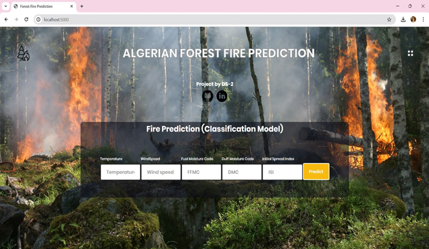
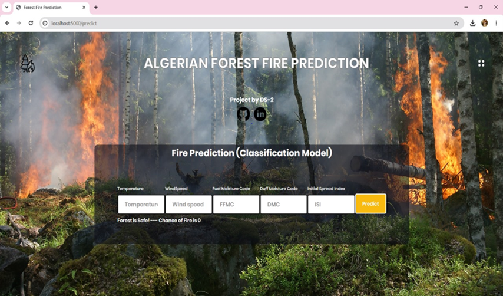
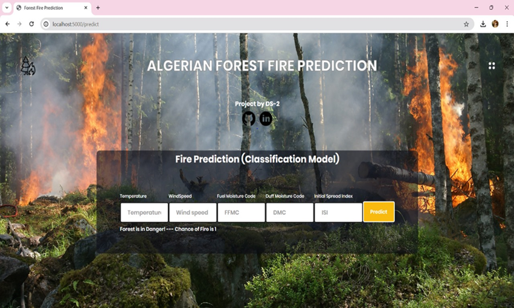

<!DOCTYPE html>
<html lang="en">
<head>
  <meta charset="UTF-8">
</head>
<body style="font-family:Arial, sans-serif; line-height:1.6; color:#333; padding:20px; max-width:800px; margin:auto;">

  <h1>🔥 Wildfire Prediction using Machine Learning</h1>

  <h2>📘 Project Overview</h2>
  <ul>
    <li>Developed a <strong>machine learning-based wildfire prediction system</strong> using meteorological data from the <em>UCI Algerian Forest Fires dataset</em>.</li>
    <li>The system helps in <strong>early detection of wildfires</strong> by analyzing temperature, rainfall, wind speed, and relative humidity.</li>
    <li>Built as part of the <strong>B.Tech Data Science final year project</strong> at Bapatla Engineering College.</li>
  </ul>

  <h2>🎯 Objectives</h2>
  <ul>
    <li>Predict the occurrence of wildfires in forest regions of <strong>Northwest Algeria</strong>.</li>
    <li>Improve model accuracy using ensemble methods and <strong>hyperparameter tuning</strong>.</li>
    <li>Provide a <strong>web-based interface</strong> for real-time prediction and visualization.</li>
  </ul>

  <h2>🧠 Machine Learning Models Used</h2>
  <ul>
    <li>✅ Random Forest Classifier</li>
    <li>✅ XGBoost</li>
    <li>✅ Logistic Regression</li>
    <li>✅ Decision Tree</li>
    <li>✅ K-Nearest Neighbors</li>
  </ul>

  <h2>⚙️ Tech Stack</h2>
  <ul>
    <li><strong>Programming Language:</strong> Python</li>
    <li><strong>Libraries:</strong> pandas, seaborn, matplotlib, sklearn, xgboost</li>
    <li><strong>Framework:</strong> Flask (for web interface)</li>
    <li><strong>IDE:</strong> VS Code, Anaconda</li>
    <li><strong>Data Source:</strong> <a href="https://archive.ics.uci.edu/" target="_blank">UCI ML Repository - Algerian Forest Fires Dataset</a></li>
  </ul>

  <h2>🧪 Model Performance</h2>
  <table border="1" cellpadding="8" cellspacing="0" style="border-collapse: collapse;">
    <thead>
      <tr>
        <th>Model</th>
        <th>Accuracy</th>
        <th>Precision</th>
        <th>Recall</th>
        <th>F1-Score</th>
      </tr>
    </thead>
    <tbody>
      <tr>
        <td>Logistic Regression</td>
        <td>95.7%</td>
        <td>95%</td>
        <td>96%</td>
        <td>95%</td>
      </tr>
      <tr>
        <td>Decision Tree</td>
        <td>97.2%</td>
        <td>96%</td>
        <td>98%</td>
        <td>97%</td>
      </tr>
      <tr>
        <td>Random Forest</td>
        <td>97.2%</td>
        <td>95%</td>
        <td>96%</td>
        <td>97%</td>
      </tr>
      <tr>
        <td>KNN Classifier</td>
        <td>95.8%</td>
        <td>95%</td>
        <td>97%</td>
        <td>96%</td>
      </tr>
      <tr>
        <td><strong>XGBoost</strong></td>
        <td><strong>97.5%</strong></td>
        <td><strong>98%</strong></td>
        <td>97%</td>
        <td>96%</td>
      </tr>
    </tbody>
  </table>

  <h2>💡 Key Features</h2>
  <ul>
    <li>🧹 Robust <strong>data preprocessing</strong> and cleaning pipeline</li>
    <li>📈 Feature selection and correlation analysis</li>
    <li>📊 EDA visualizations and month-wise fire analysis</li>
    <li>🧪 Split data into training/testing and applied <strong>standardization</strong></li>
    <li>🌐 Interactive <strong>Flask-based UI</strong> for input and predictions</li>
  </ul>

  <h2>🚀 Future Enhancements</h2>
  <ul>
    <li>Integrate with <strong>real-time weather APIs</strong> for live prediction</li>
    <li>Add <strong>geospatial visualizations</strong> using maps</li>
    <li>Extend to other regions and include more environmental variables</li>
    <li>Design a <strong>mobile-friendly UI</strong> for wider accessibility</li>
  </ul>

  <h2>📷 Screenshots</h2>

  
🌐 Web Interface

  

  
🌲 Forest is Safe Condition

  

  
🔥 Forest is Not Safe Condition

  
  

</body>
</html>
